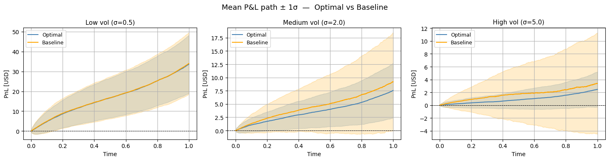
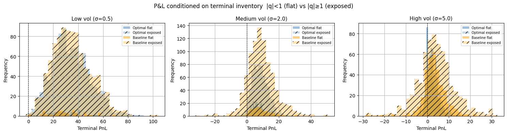

# Avellaneda-Stoikov Market Making Simulator

This repository implements an HFT Market Making simulator based on the **Avellaneda-Stoikov (2008)** framework. It compares an **Optimal Inventory Strategy** against a **Symmetric Baseline** across different volatility regimes. You can find an overview of the article [here](https://francescofinardi.com/2026/03/05/extended-avellaneda-stoikov-market-making-model/) and the full article [here](https://drive.google.com/file/d/1jfioQFVS0LzTpsc2N-cQENhkQt-xqwPv/view).




---

## Key Features

* **Optimal Quotes**: Dynamic adjustment of reservation price and spread based on inventory ($$q$$) and time ($$T-t$$).
* **Monte Carlo Engine**: 1,000 simulations per scenario (Low, Medium, High volatility).
* **Realistic Dynamics**: U-shaped intraday order arrival ($$\alpha(t)$$) and Gamma-distributed fill sizes.
* **Analysis**: Automatic generation of P&L paths, inventory distributions, and Sharpe ratio tables.

## Requirements

```bash
pip install numpy matplotlib scipy

```

## How to Run

1. Clone the repository.
2. Run the simulation:
```bash
python market_maker.py

```

3. Check the `img/` folder for generated performance plots (PDF/PNG).

## Mathematical Core

The optimal reservation price $r$ is calculated as:


$$r(s, t, q) = s - q\gamma\sigma^2(T-t)$$

Where:

* **$s$**: Mid-price
* **$\gamma$**: Risk aversion
* **$q$**: Inventory
* **$\sigma$**: Volatility

---

*References: Avellaneda & Stoikov (2008), Quantitative Finance 8(3). — Fushimi, González Rojas & Herman (2018), Stanford Technical Report. — Cartea, Jaimungal & Penalva (2015), Algorithmic and High-Frequency Trading, Cambridge UP.*


